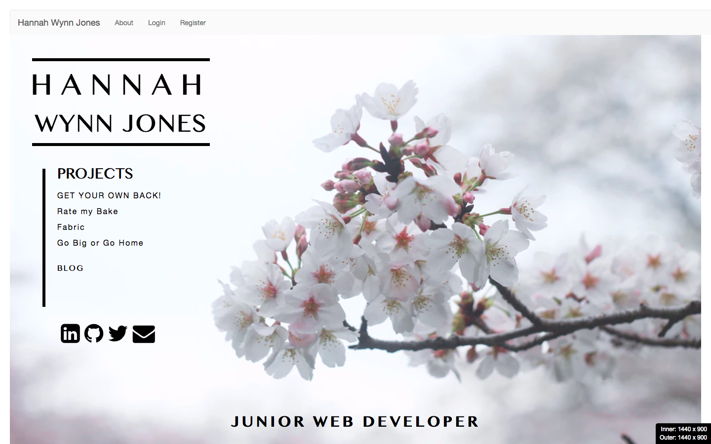

# My website

### https://fast-badlands-97546.herokuapp.com/

www.hannahwynnjones.com (previously)

<p align="center" style="padding: 20px 0;">
  
</p>

Full app can be seen [here](www.hannahwynnjones.com).

**[Gallery](#gallery)**  

#### Approach/ how it works

As well as showing my contact details, I wanted a place to showcase all the links to the projects that I'd developed while being a student at General Assembly on the Wed Development Immersive Course.  

I also wanted to add blogs to this site to show any techniques or cool tricks that would make my websites more interesting.

#### The Build

The app is a MEAN stack so I started by fleshing out the backend and then the basic CRUD elements for the blog and projects.  I then added authentication, image upload and comments schema.

I noticed that that my blogs looked pretty awful when they were displayed, to solve this I wanted a way to change the plain text to Markdown easily.  I ended up choosing a <zero-md> method (which I will talk about in my first blog post!)

#### Installation and deployment instructions

This app already has a `bower.json` file with `angular` as a dependency. To install run:

```sh
$ bower install && npm install
```
Deploying to Heroku:

`$ heroku: create`

I then added Herkou config varibales:

```sh
$ heroku config:add NODE_ENV=production
$ heroku config:add NPM_CONFIG_PRODUCTION=false
```

To create the mongo database:

`$ heroku addons:create mongolab`


#### Unsolved problems and challenges

Finding the Markdown converter proved difficult as there were lots of versions and some were terribly complicated.

I'd like to add a few more animations to make the site more interesting, I played around with modals which weren't successful so I'd like to go back to that again.

I'm aware it's not fully responsive and that's something I'd like to fix.

The first image on the 'about' page acts very strangely and sometimes appears and sometimes doesn't, I'd like to see what I can do to change that.  Perhaps using a smaller resolution image.

# Gallery

<h5>Welcome page</h5>
<br>
<p align="center">
  
</p>

<h5></h5>
<br>
<p align="center" style="padding: 20px 0;">
  
</p>

<h5></h5>
<br>
<p align="center" style="padding: 20px 0;">
  
</p>

<h5></h5>
<br>
<p align="center" style="padding: 20px 0;">
  
</p>
